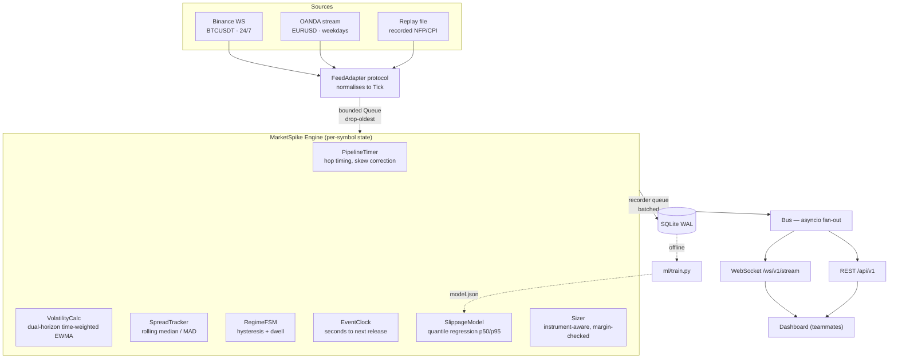
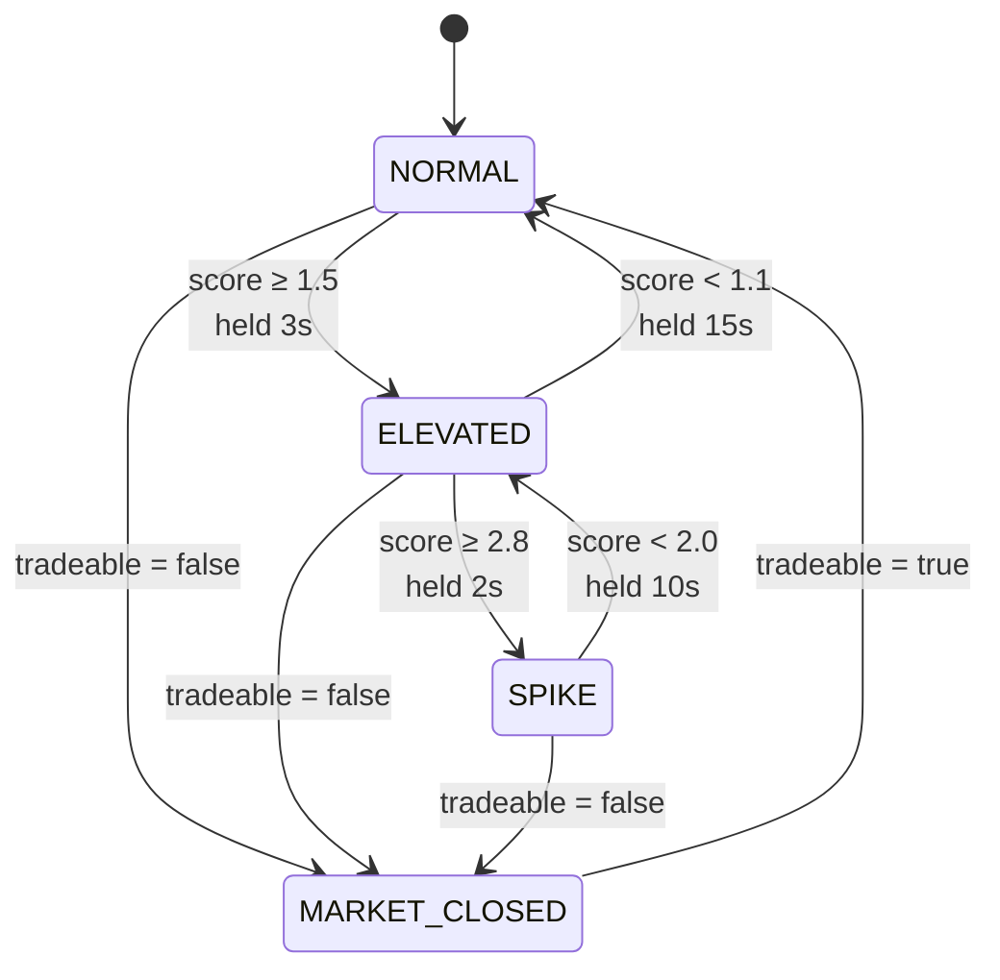

# MarketSpike — Design Specification

| | |
|---|---|
| **Version** | 1.0 |
| **Date** | 2026-08-17 |
| **Status** | Approved — ready for implementation planning |
| **Repository** | `github.com/Olwethu-Dlamini/MarketSpike` |
| **Backend owner** | Olwethu Dlamini |
| **Frontend** | Teammate(s) — build against §12, frozen |
| **Build window** | 24–48 hours (hackathon, Track 1: Software / App Development) |

---

## 1. Problem and thesis

Every retail position-size calculator computes:

```
lots = (balance × risk%) / (stop_loss_pips × pip_value)
```

This formula assumes the trader is filled at the price they saw, at the moment they saw it. Both assumptions fail hardest during high-impact economic releases (NFP, CPI, FOMC) — precisely when position sizing matters most. Spreads widen by multiples, quote latency spikes, and the fill arrives at a materially worse price than the one the decision was based on.

**Thesis.** A trader sizing a position during a CPI print using a conventional calculator is taking materially more risk than they specified — and no tool tells them. MarketSpike measures the two costs the standard formula omits (execution latency and expected slippage), and returns a size that accounts for both.

**The claim to be demonstrated:** at the moment of a high-impact release, the conventional calculator over-sizes by 30–50%.

### 1.1 Why latency and slippage belong in the same application

They are not two features stapled together. Measured pipeline latency Δ is an **input feature** to the slippage model:

> The trader decides at time `t`, looking at price `mid_t`. Their order reaches the venue at `t + Δ`. The cost they pay is a function of what the market did during Δ.

Latency is not a vanity metric displayed beside the calculator. It is a term in the calculator.

---

## 2. Scope

### 2.1 In scope (core, must ship)

- Live market data ingest for **BTCUSDT** (Binance) and **EURUSD** (OANDA practice)
- Genuine, clock-skew-corrected latency measurement across three pipeline hops
- Volatility estimation and a regime state machine with hysteresis
- Economic calendar with pre-event and event-window context
- An empirically-trained quantile slippage model (p50 / p95)
- Instrument-aware position sizing with margin checks
- REST + WebSocket API, frozen and documented from hour 2
- SQLite recording of ticks, regimes, latency and calculations
- Replay mode driving a real recorded volatility event

### 2.2 Out of scope

- Order placement or broker execution of any kind
- User accounts, authentication, multi-tenancy
- Portfolio-level or correlated risk aggregation
- Options, futures, or any derivative pricing
- Mobile-native clients
- Horizontal scaling, containerisation, cloud deploy

### 2.3 Stretch (only if core is complete and rehearsed)

- Kraken adapter as a third feed
- Multi-venue spread comparison
- Live economic-calendar API adapter replacing the static dataset
- Order-book depth beyond top-of-book

### 2.4 Non-negotiable constraints

1. **No fabricated number is ever presented as measured.** Every latency and tick value carries a `source` field (`measured` / `estimated` / `simulated`). The frontend must badge anything not `measured`.
2. **Disk I/O never blocks the data path.** A latency product that stalls on `fsync` is measuring its own defect.
3. **The API contract is published before the implementation.** Teammates are unblocked at hour 2 and never wait on backend internals.

---

## 3. Instruments and data feeds

Two symbols, deliberately chosen for complementary properties.

| | **BTCUSDT** | **EURUSD** |
|---|---|---|
| Venue | Binance | OANDA v20 (fxPractice) |
| Availability | 24/7 | Sun 21:00 → Fri 21:00 UTC |
| Role | Demo reliability — always live | Thesis credibility — the pair the pitch is about |
| Transport | WebSocket | HTTP/1.1 chunked NDJSON |
| Auth | None | Bearer token (free practice account) |
| Venue timestamp | via `depth@100ms` side-channel (§3.2) | `time` (RFC3339, ns) |
| Top-of-book qty | Yes (`B`, `A`) | Yes (`liquidity`) |

### 3.1 Why both, and why not forex alone

**Hackathons are judged on weekends. The forex market is closed on weekends.** An EURUSD-only demo on a Sunday afternoon shows a flat line and zero ticks — the entire application appears broken through no fault of the code. BTCUSDT is the availability guarantee: it streams at all hours, requires no API key, no signup, and no jurisdictional negotiation.

**But BTCUSDT alone weakens the thesis.** The pitch is about NFP and CPI, and while BTC does react to US macro prints, EURUSD is the instrument a forex trader actually sizes. Shipping only crypto invites the question "so why is your calculator talking about pips?"

Both, therefore: EURUSD carries the argument, BTCUSDT guarantees the demo runs.

### 3.2 Binance adapter

```
wss://stream.binance.com:9443/stream?streams=btcusdt@bookTicker
```

No API key. Message:

```json
{"stream":"btcusdt@bookTicker","data":{
  "u":400900217,"s":"BTCUSDT",
  "b":"63120.50","B":"1.234","a":"63121.90","A":"0.876"}}
```

`B` and `A` give top-of-book quantities, which feed the `book_imbalance` feature at no extra cost.

**`bookTicker` carries no venue event time.** This was verified empirically against the live venue, and it contradicts an earlier draft of this section which assumed an `E` field:

| Stream | Keys | Venue timestamp |
|---|---|---|
| `btcusdt@bookTicker` | `A B a b s u` | **absent** |
| `btcusdt@depth20@100ms` | `asks bids lastUpdateId` | absent |
| `btcusdt@depth@100ms` | `E U a b e s u` | **present** |

Without a venue timestamp, `excess_transit_us` (§6.2) would be identically zero for BTCUSDT and the latency waterfall would show only engine time — on the one symbol guaranteed to be live during judging.

**Resolution — a timing side-channel.** Subscribe to **both** `btcusdt@bookTicker` and `btcusdt@depth@100ms` on a single combined WebSocket. `bookTicker` drives ticks and prices as before; the depth frames are read **solely** for their `E` field and otherwise discarded. No order-book snapshot, no diff application, no book maintenance.

This is legitimate rather than a workaround: **transit latency is a property of the connection, not of an individual quote.** Both streams traverse the same TCP connection to the same venue endpoint, so a 10 Hz timing sample characterises the path the quotes travel. The adapter records the raw transit measured on each depth frame and applies it to the ticks that follow, so the skew estimator observes genuinely measured values while `recv_ts_ns` stays exactly truthful.

EURUSD is unaffected — OANDA's `time` field is a real venue timestamp at nanosecond precision (§3.3).

**Baseline volatility seeding** (§7.2) uses one unauthenticated REST call:
```
GET https://api.binance.com/api/v3/klines?symbol=BTCUSDT&interval=1m&limit=1440
```

### 3.3 OANDA adapter

```
GET https://stream-fxpractice.oanda.com/v3/accounts/{accountID}/pricing/stream
    ?instruments=EUR_USD
Authorization: Bearer {OANDA_TOKEN}
```

This is an HTTP chunked stream of newline-delimited JSON, **not** a WebSocket. The `FeedAdapter` protocol (§5.1) abstracts over the transport difference; the engine never learns which it is.

```json
{"type":"PRICE","time":"2026-08-17T14:23:01.123456789Z","instrument":"EUR_USD",
 "bids":[{"price":"1.08512","liquidity":10000000}],
 "asks":[{"price":"1.08525","liquidity":10000000}],
 "status":"tradeable","tradeable":true}
```

Notable properties:
- `time` carries **nanosecond** venue precision — better than Binance's milliseconds
- `tradeable` gives explicit market-closed detection rather than inferring it from silence
- `liquidity` provides real depth for the imbalance feature
- `{"type":"HEARTBEAT"}` arrives every ~5 s; used for liveness, excluded from tick statistics

**Historical data** for replay scenarios and model training:
```
GET https://api-fxpractice.oanda.com/v3/instruments/EUR_USD/candles
    ?price=BA&granularity=S5&from=...&to=...
```
Returns 5-second bid **and** ask OHLC — real spreads around a real past NFP release. Capped at 5000 candles per request (≈6.9 hours); paginate for longer windows.

**Fallback if OANDA registration stalls:** TraderMade WebSocket (free tier, provides bid/ask) or Finnhub (`OANDA:EUR_USD`). Both are inferior — Finnhub's forex stream is last-trade, not bid/ask, which is unusable for a spread-widening product. Register the OANDA practice account **before hour 0**.

### 3.4 Market-closed handling

When `tradeable: false` or no EURUSD tick arrives for 120 s during expected market hours:

- Symbol state → `MARKET_CLOSED`, broadcast on the stream
- Regime FSM freezes; the last regime is retained but flagged `stale: true`
- Sizing requests for EURUSD still succeed, using last-known spread with `stale_quote: true`
- BTCUSDT is entirely unaffected

The UI shows a closed badge on EURUSD. This is a normal operating state, not an error.

---

## 4. System architecture



### 4.1 Process model

**One FastAPI process, one asyncio event loop.** Feed clients, engine, and API share it. Chosen over a split ingester/API design because:

- It removes an IPC hop from a product whose thesis is latency
- It is one thing to launch on stage, not two plus a broker
- It fits the build window

The risk — one blocking call stalling the loop — is contained by routing every disk operation through a thread executor and bounding every queue.

**The seams are drawn so the split is a later refactor, not a rewrite.** The engine publishes to an abstract `Bus`. Today that is in-process asyncio fan-out; substituting Redis pub/sub touches one file.

### 4.2 Concurrency and backpressure

| Boundary | Mechanism | On overflow |
|---|---|---|
| Feed → Engine | `asyncio.Queue(maxsize=5000)` | Drop oldest, `feed_dropped_total++` |
| Engine → Recorder | `asyncio.Queue(maxsize=10000)` | Drop, `recorder_dropped_total++` |
| Bus → each WS client | per-client `deque(maxlen=200)` | Drop oldest, `client_dropped++` |
| Recorder → disk | thread executor, batch 500 rows / 250 ms | — |

**Dropping is the correct failure mode.** Losing training rows during a spike is recoverable; adding queueing delay during a spike corrupts the exact measurement the spike exists to test. Every drop counter is exposed on `/health` so loss is visible rather than silent.

---

## 5. Module layout

```
marketspike/
├── feeds/
│   ├── base.py           FeedAdapter protocol, Tick dataclass
│   ├── binance.py        WebSocket adapter
│   ├── oanda.py          HTTP chunked-stream adapter
│   └── replay.py         file-driven adapter, identical interface
├── clock/
│   ├── skew.py           rolling-minimum transit floor estimator
│   └── sync.py           NTP-style client handshake
├── engine/
│   ├── pipeline.py       PipelineTimer — hop stamping
│   ├── volatility.py     time-weighted dual-horizon EWMA
│   ├── spread.py         rolling median / MAD z-score
│   ├── regime.py         RegimeFSM
│   ├── bus.py            Bus abstraction
│   └── supervisor.py     task supervision with backoff
├── calendar/
│   ├── static_events.json
│   └── clock.py          EventClock — proximity and phase
├── risk/
│   ├── instruments.py    registry
│   ├── slippage.py       model inference (pure dot product)
│   └── sizing.py         position sizing
├── store/
│   ├── schema.sql
│   ├── recorder.py       batched async writer
│   └── queries.py        read-only query layer
├── api/
│   ├── schemas.py        Pydantic models — single source of truth
│   ├── rest.py
│   └── ws.py
├── ml/
│   ├── features.py       feature builder with leakage guard
│   ├── train.py          quantile regression fit
│   └── evaluate.py       pinball loss, coverage, per-regime breakdown
├── config.py
└── main.py
```

**Design rule.** Every module has one purpose, a stated interface, and stated dependencies. `engine/` never imports `api/`. `risk/` never imports `feeds/`. Anything importing `sqlite3` outside `store/` is a defect.

### 5.1 The FeedAdapter protocol

```python
class FeedAdapter(Protocol):
    symbol: str
    venue: str

    async def stream(self) -> AsyncIterator[Tick]:
        """Yield normalised ticks until cancelled. Must not raise on
        transient network failure — reconnect internally with backoff."""

    async def seed_baseline(self) -> float:
        """Return initial slow-horizon variance from historical data."""
```

```python
@dataclass(frozen=True, slots=True)
class Tick:
    symbol: str
    venue_ts_ns: int      # venue clock — skewed relative to ours
    recv_ts_ns: int       # our clock, monotonic-anchored
    bid: float
    ask: float
    bid_qty: float
    ask_qty: float
    tradeable: bool
    source: Literal["measured", "simulated"]
```

**Replay emits the same `Tick` type through the same code path.** Demo mode is not a branch in the engine; it is a different adapter. This is what makes the replay demo trustworthy — it exercises the identical logic, differing only in the `source` field.

---

## 6. Latency subsystem

### 6.1 The four timestamps

```
  venue          local recv        engine done       client render
    t0 ─────────── t1 ──────────────── t2 ─────────────── t4
        transit         compute            delivery
    (foreign clock)   (same clock ✓)     (foreign clock)
```

`t2 − t1` is **exact** — one machine, one monotonic clock, no correction needed. This is engine compute time.

The other two cross a clock boundary. They are different problems requiring different solutions.

### 6.2 Venue → local: no handshake is possible

You cannot NTP-synchronise with Binance or OANDA. Their event timestamp comes from their clock, ours from ours; the difference is `skew + true_transit`, and the two are not separable from a single observation.

Therefore **do not claim absolute transit.** Claim excess transit:

```
raw_transit = t1 − t0
floor       = rolling_min(raw_transit, window = 60 s)
excess      = raw_transit − floor
```

This applies the minimum-filter principle common to Cristian's algorithm and NTP's clock filter: the fastest observation in a 60-second window is the one carrying least queueing delay, so it approximates the pure skew-plus-baseline offset. Subtracting it **cancels the skew term entirely**, leaving queueing and congestion above baseline.

This is also the quantity that actually matters. During a CPI print, the baseline offset is constant while transit *jitter* explodes. Excess transit is the signal; the floor is the uninteresting constant.

Reported as `excess_transit_us`, accompanied by `baseline_includes_clock_offset: true` so no consumer mistakes it for absolute one-way delay.

**Clamp:** if `raw_transit < floor` (clock drift, or a genuinely faster path), reset the floor to the new minimum and report `excess = 0`. Never report negative latency.

### 6.3 Server → client: handshake is possible

Here the standard four-timestamp NTP exchange works, carried over the existing WebSocket:

```
client_send (c0) ──▶ server_recv (s1)
                     server_send (s2) ──▶ client_recv (c3)

round_trip = (c3 − c0) − (s2 − s1)
offset     = ((s1 − c0) + (s2 − c3)) / 2
```

Run every 10 seconds. Retain the sample with the **lowest** `round_trip` from the last 8 — the least-delayed sample carries the least asymmetry error, which is the standard minimum-filter used by NTP itself. Apply its `offset` to correct client timestamps.

`t4 − t2` then becomes a real delivery latency rather than an estimate.

### 6.4 Exposed metrics

Rolling p50 / p95 / p99 per hop, plus the stack, over a configurable window (default 5 min).

**Percentiles, not means.** Mean latency conceals exactly the tail events this product exists to detect. A 20 ms mean with a 400 ms p99 is a materially different trading environment from a 20 ms mean with a 25 ms p99, and the mean cannot distinguish them.

### 6.5 The honesty guard

Every latency and tick value carries `source ∈ {measured, estimated, simulated}`.

- `measured` — directly observed on a real clock
- `estimated` — derived through skew correction (excess transit)
- `simulated` — produced by the replay adapter

Replay-mode frames emit `simulated`, and the API contract obliges the frontend to badge them visibly. **Nothing in this system presents a synthetic number as a measured one.** This single field is the difference between a demonstration and a misrepresentation.

---

## 7. Volatility and regime detection

### 7.1 Time-weighted EWMA

Quote updates arrive irregularly, and they arrive *faster* during volatility. A tick-count-indexed EWMA therefore double-counts spikes: the quantity being measured alters the sampling rate of the measurement. Decay on elapsed time instead.

```
Δt   = t − t_prev                          [seconds]
λ    = exp(−Δt / τ)
r    = ln(mid_t / mid_{t−1})
σ²_t = λ·σ²_{t−1} + (1 − λ)·(r² / Δt)      [variance per second]
```

Dividing by `Δt` normalises to a variance *rate* — variance per second — making the estimate independent of sampling density.

**Both horizons must carry the same units.** `σ²_fast` and `σ²_slow` differ only in decay constant τ, not in normalisation; both are variance-per-second. Normalising by `τ/Δt` instead would express each in variance-per-horizon and the ratio below would be scaled by `τ_fast/τ_slow` — silently off by a factor of 60.

Two horizons: **τ_fast = 30 s**, **τ_slow = 30 min**.

```
V = σ_fast / σ_slow
```

Unitless, and equal to 1 when current volatility matches baseline. This is the real `Volatility_current / Volatility_average` that the original draft named but never computed.

**Guards:** skip ticks where `Δt < 1 ms` (duplicate quote updates) or `|r| > 0.05` (bad print). Count and expose rejections.

### 7.2 Cold start — a demo-critical detail

A 30-minute EWMA needs roughly 5τ ≈ 2.5 hours of ticks before it is meaningful. Start the server five minutes before judging and every ratio displayed is noise.

**Fix:** at boot, seed `σ_slow` from historical data — Binance klines (§3.2) or OANDA S5 candles (§3.3), 24 hours, one REST call per symbol. The engine is warm on tick one.

Seeding must produce the same units as §7.1. From 1-minute closes: compute log returns `r_i`, then `σ²_slow_seed = mean(r_i²) / 60` to convert variance-per-minute into variance-per-second. Seeding in the wrong unit is the same factor-of-60 error described above, and it would make every startup ratio wrong until the EWMA decayed the bad seed away.

`warmup_complete: bool` is broadcast on the stream; the UI greys out regime display until it is true. Warmup for `σ_fast` requires only ~2.5 minutes of live ticks.

### 7.3 Spread z-score

Spread distributions are fat-tailed, so mean and standard deviation are the wrong estimators. Use median and MAD:

```
z = (spread_bps − median_60m) / (1.4826 · MAD_60m)
```

The 1.4826 constant makes MAD a consistent estimator of σ under normality, so `z` remains interpretable on the familiar scale while being robust to the outliers that define this dataset.

Implemented over a rolling 60-minute ring buffer, recomputed every 5 s rather than every tick.

### 7.4 Composite score

```
score = 0.6 · clamp(log₂ V, 0, 4)  +  0.4 · clamp(z / 2, 0, 4)      →  0 … 4
```

Two independent signals — realised volatility and quoted spread — because they can diverge. Volatility can rise on thin genuine movement without spread widening; spread can widen on liquidity withdrawal before price moves. Either alone produces false negatives.

Weights and thresholds live in config and are tunable without code changes.

### 7.5 The regime state machine

Three volatility states, with **asymmetric hysteresis and dwell times**:

| Transition | Trigger | Min dwell |
|---|---|---|
| NORMAL → ELEVATED | score ≥ 1.5 | 3 s |
| ELEVATED → SPIKE | score ≥ 2.8 | 2 s |
| SPIKE → ELEVATED | score < 2.0 | 10 s |
| ELEVATED → NORMAL | score < 1.1 | 15 s |

Entry thresholds sit above exit thresholds (hysteresis), and exit dwell exceeds entry dwell. **The asymmetry is deliberate and encodes the asymmetric cost of the two errors:** failing to warn a trader of a spike costs them real money; a regime that lingers ten seconds too long costs nothing.

This directly replaces `random.choice()` in the original draft, which reassigned regime every 500 ms and produced three transitions per second.



### 7.6 Event context is orthogonal

Regime is derived from price and is therefore **backward-looking by construction** — it cannot tell a trader that a print is thirty minutes away. That information comes from the calendar, not the tape.

| Phase | Window |
|---|---|
| `CLEAR` | otherwise |
| `PRE_EVENT` | T−30 min → T−1 min |
| `EVENT_WINDOW` | T−1 min → T+15 min |

Carried independently, so the stream can report `ELEVATED + PRE_EVENT` — which is the actionable state this product exists to surface.

### 7.7 Quote rate as a free signal

Once time-weighting is in place, message arrival rate stops being a nuisance and becomes an independent volatility proxy. `quote_rate_hz` (exponentially-smoothed message count per second) typically rises *before* spread widens, and is exposed on the stream and used as a model feature.

---

## 8. Economic calendar

**A curated static JSON dataset**, not an API integration.

This is the correct engineering decision rather than a shortcut. The US Bureau of Labor Statistics publishes its full annual release schedule in advance; FOMC dates are published a year ahead. These dates are among the few genuinely static datasets in finance. An API call would introduce a key, a rate limit, and a network failure mode in order to fetch data that cannot change.

```json
{
  "events": [
    {"name": "US Non-Farm Payrolls", "importance": "high",
     "country": "US", "event_ts": "2026-09-04T12:30:00Z",
     "affects": ["EURUSD", "BTCUSDT"]},
    {"name": "US CPI (YoY)", "importance": "high",
     "country": "US", "event_ts": "2026-09-10T12:30:00Z",
     "affects": ["EURUSD", "BTCUSDT"]},
    {"name": "FOMC Rate Decision", "importance": "high",
     "country": "US", "event_ts": "2026-09-16T18:00:00Z",
     "affects": ["EURUSD", "BTCUSDT"]}
  ]
}
```

Loaded at startup into `calendar_events`, hot-reloadable via `SIGHUP`. Populated with three months of high-impact US releases.

`EventClock` exposes `signed_seconds_to_event` (negative before, positive after, clipped to ±1800) and the current phase per symbol.

An adapter interface remains open for a live calendar source as stretch work.

---

## 9. Slippage model (ML design)

### 9.1 The target problem

There is no broker, so no fills are observed. Inventing a slippage number is what the original draft did, and it is that draft's weakest point. Instead, define a target that is genuinely observable from recorded data.

A trader decides at `t`, looking at `mid_t`. Their order reaches the venue at `t + Δ`. For a buy:

```
cost_bps = (ask_{t+Δ} − mid_t) / mid_t × 10⁴

         = half_spread_{t+Δ}  +  (mid_{t+Δ} − mid_t)/mid_t × 10⁴
           ─────────────────     ────────────────────────────────
           spread component      adverse drift component
```

Both terms are recoverable from the tick recording.

This is not improvised: it is **implementation shortfall measured against arrival price**, standard market-microstructure methodology. Using the correct name costs nothing and signals familiarity with the field.

### 9.2 Direction handling

Trade direction is unknown at feature time, so **each observation is emitted twice** — once as a buy, once as a sell with the drift sign flipped.

Over a latency horizon of tens of milliseconds, the assumption that the trader holds no directional edge is well-founded. The consequence is that p50 lands near the half-spread while p95 captures the adverse tail — and p95 is the quantity that matters for sizing.

### 9.3 Features

All strictly observable at or before `t`.

| Feature | Source | Rationale |
|---|---|---|
| `log_v_ratio` | §7.1 | realised volatility regime |
| `spread_z` | §7.3 | spread abnormality |
| `log_spread_bps` | tick | current cost level |
| **`log_latency_ms`** | §6 | **the coupling — measured latency enters the cost model** |
| `quote_rate_hz` | §7.7 | leads spread widening |
| `book_imbalance` | `(qb−qa)/(qb+qa)` | directional pressure at top of book |
| `signed_secs_to_event` | §8, clipped ±1800 | anticipatory widening |
| `in_event_window` | §8, dummy | discrete regime shift |
| `abs_return_5s` | tick history | recent realised movement |

### 9.4 Leakage discipline

**Features ≤ `t`. Target strictly from `t + Δ`.**

Enforced structurally in `ml/features.py` — the builder receives two separate timestamp-bounded views and cannot access post-`t` data when constructing features. A unit test asserts that no feature timestamp exceeds its target timestamp (§15.3).

This is the single easiest way to produce a result that looks excellent and is worthless. It gets a dedicated test.

### 9.5 Model

**Linear quantile regression, pinball loss, τ ∈ {0.5, 0.95}.** Two models, nine coefficients each, fitted per symbol.

Linear is correct on every axis that matters here:

- Trains in seconds on a laptop
- **Coefficients are interpretable** — "+0.31 bps per doubling of latency" is a statement that can be shown to a judge and pointed at
- Structurally resistant to overfitting on this feature count
- **Inference is a dot product** — ships as a ~2 KB `model.json`, runs inline in the hot path, requires no model server and no ML runtime dependency on demo day

Fitted with `sklearn.QuantileRegressor`; served as pure-Python arithmetic.

### 9.6 Baseline

```
cost_predicted = current_half_spread
```

This is precisely the assumption every retail lot-size calculator makes implicitly — that slippage is zero and the spread is what you pay. Beating it is therefore a directly meaningful claim about existing tools, not an abstract benchmark.

### 9.7 Evaluation

On a **time-ordered** train/test split. Never random — shuffling a time series leaks the future into the past and inflates every metric.

1. **Pinball loss** versus baseline at both quantiles.
2. **Coverage calibration** — is the p95 prediction exceeded approximately 5% of the time? Report the empirical figure even where it comes out at 7%. A calibrated interval is the claim being made; an honestly-reported miss is worth more than an unexamined one.
3. **Per-regime breakdown** — metrics split across NORMAL / ELEVATED / SPIKE.

Item 3 is the decisive chart. The baseline is entirely adequate in calm markets and catastrophically wrong during a print. Showing the error gap widening across regimes *is* the product thesis rendered as evidence.

### 9.8 Training data

| Symbol | Rate | 1 hour | Overnight |
|---|---|---|---|
| BTCUSDT | 5–20 updates/s | ~50 k rows | ~1 M rows |
| EURUSD (open) | 2–10 updates/s | ~20 k rows | ~400 k rows |

Far more than nine linear coefficients require. **The recorder starts at hour 2 and never stops** (§16) — training data is the only deliverable that cannot be compressed by working harder.

### 9.9 EURUSD degraded training path

If the hackathon falls entirely outside forex market hours, no live EURUSD ticks exist. Train instead from historical OANDA S5 bid/ask candles (§3.3).

**Stated limitation:** 5-second candles cannot resolve slippage at a 50 ms horizon, so the `log_latency_ms` coefficient is unidentifiable from candle data.

**Mitigation — partial pooling.** Fit the eight non-latency coefficients on EURUSD candle data, and pool the latency coefficient from the BTCUSDT model. The model card records this explicitly:

```json
{"symbol": "EURUSD", "latency_coef_source": "pooled_from_BTCUSDT",
 "reason": "insufficient tick-resolution data (market closed)"}
```

An honest, documented approximation is defensible. A silent one is not.

### 9.10 Fallback

Pre-fitted coefficients are committed to `model.json` in the repository. If training fails or does not complete, inference proceeds and every response reports `model_source: "fallback_coefficients"`. `GET /api/v1/model/card` states it plainly. **The demo never degrades silently.**

---

## 10. Position sizing

### 10.1 Corrected formulation

The original draft hardcoded `pip_value_per_lot = 10.0` — a USD-quoted-major assumption presented as a universal constant. It is wrong for USDJPY, gold, indices, and for BTCUSDT.

Work in price units; present in pips.

```
risk_budget   = balance × risk_pct / 100                      [account ccy]
adverse_price = stop_distance_price + slippage_price(τ)       [quote ccy per unit]
value_per_pt  = contract_size × fx(quote_ccy → account_ccy)   [account ccy per price unit per lot]

raw_lots      = risk_budget / (adverse_price × value_per_pt)
```

`pip_value_per_lot = pip_size × contract_size × fx` — derived, never stored.

### 10.2 Instrument registry

| Field | EURUSD | USDJPY | XAUUSD | BTCUSDT |
|---|---|---|---|---|
| `pip_size` | 0.0001 | 0.01 | 0.01 | 1.0 |
| `contract_size` | 100 000 | 100 000 | 100 | 1 |
| `quote_ccy` | USD | JPY | USD | USDT |
| `min_lot` | 0.01 | 0.01 | 0.01 | 0.0001 |
| `lot_step` | 0.01 | 0.01 | 0.01 | 0.0001 |
| `margin_rate` | 0.0333 | 0.0333 | 0.05 | 0.10 |

Seeded from `instruments.json`, served via `GET /api/v1/instruments`. **The UI builds its symbol picker from this endpoint and hardcodes nothing.**

### 10.3 FX resolution

Quote currency → account currency. Identity where they match; live cross where the feed carries it; otherwise fall back to 1.0 and set `fx_assumed: true` in the response.

Same principle as the latency `source` field: the API never conceals an assumption behind a confident-looking number.

### 10.4 Rounding is directional

**Always round *down* to `lot_step`.**

Rounding a risk-limited quantity upward breaches the risk budget the user specified, which defeats the purpose of the calculation. Then recompute the *actual* risk at the rounded size and return it — after rounding down, real risk sits below target, and the user should see the true figure rather than the requested one.

### 10.5 Margin check

```
required_margin = lots × contract_size × price × margin_rate    → account ccy
```

If it exceeds free margin, cap the size at the margin limit and set `capped_by: "margin"`. A size that is correct on risk but unfillable on margin is still a wrong answer.

### 10.6 Response

```json
{
  "naive_lot_size": 0.50,
  "recommended_lot_size": 0.38,
  "overexposure_pct": 31.6,
  "slippage_p50_pips": 1.4,
  "slippage_p95_pips": 6.2,
  "stop_distance_pips": 20.0,
  "effective_adverse_pips": 26.2,
  "actual_risk_amount_minor": 9956,
  "actual_risk_pct": 0.9956,
  "required_margin_minor": 137296,
  "capped_by": null,
  "fx_assumed": false,
  "stale_quote": false,
  "model_source": "trained",
  "model_version": "btcusdt-2026-08-17T04:12Z",
  "regime_at_calc": "SPIKE",
  "event_context": "EVENT_WINDOW",
  "latency_used_ms": 63.2,
  "latency_source": "measured",
  "warnings": [],
  "inputs_echo": {
    "symbol": "EURUSD",
    "account_balance_minor": 1000000,
    "account_ccy": "USD",
    "risk_pct": 1.0,
    "stop_distance_price": 0.0020,
    "direction": "buy",
    "quantile": "p95",
    "free_margin_minor": 1000000,
    "assumed_latency_ms": null
  }
}
```

**Worked example — these figures are arithmetically checkable, and the unit test in §15.1 asserts exactly them.** EURUSD, $10 000 balance, 1% risk, 20-pip stop, p95 slippage 6.2 pips, price 1.0850:

```
pip_value    = 0.0001 × 100 000 × 1.0        = $10.00 / lot / pip
risk_budget  = 10 000 × 1%                   = $100.00
naive        = 100 / (20.0 × 10)             = 0.500 lots
effective    = 20.0 + 6.2                    = 26.2 pips
raw          = 100 / (26.2 × 10)             = 0.3817 lots
recommended  = round_down(0.3817, 0.01)      = 0.38 lots
overexposure = (0.50 − 0.38) / 0.38          = 31.6 %
actual_risk  = 0.38 × 26.2 × 10              = $99.56   → 0.9956 %
margin       = 0.38 × 100 000 × 1.0850 × 0.0333 = $1 372.96
```

Note `actual_risk` of $99.56 against a requested $100.00 — the shortfall is the round-down (§10.4) surfacing honestly rather than the requested figure being echoed back.

**`overexposure_pct` is the most persuasive field in the application.** During a CPI print it should exceed 30%, and that single number states the entire thesis: *every other calculator is silently handing this trader a third more risk than they asked for, at precisely the moment it is most dangerous.*

### 10.7 Validation

| Condition | Response |
|---|---|
| `risk_pct ≤ 0` or `> 100` | 422, RFC 7807 |
| `stop_distance_price ≤ 0` | 422 |
| unknown `symbol` | 404 |
| `risk_pct > 5` | 200 with `warnings: ["HIGH_RISK_PCT"]` — warn, do not block |
| `free_margin` insufficient | 200 with `capped_by: "margin"` |

---

## 11. Storage

### 11.1 Write path

```
engine ──▶ Queue(10 000) ──▶ recorder task ──▶ executor thread ──▶ SQLite (WAL)
             │                  batch: 500 rows OR 250 ms
             └── full? drop + recorder_dropped_total++
```

The engine never awaits disk. Ever.

### 11.2 Pragmas

```sql
PRAGMA journal_mode = WAL;
PRAGMA synchronous  = NORMAL;
PRAGMA temp_store   = MEMORY;
PRAGMA cache_size   = -64000;   -- 64 MB
```

`synchronous = NORMAL` risks the last few milliseconds of ticks on a hard crash and runs roughly an order of magnitude faster — the correct trade for regenerable training data.

One writer connection. REST reads use a separate read-only connection, which WAL permits concurrently with the writer.

### 11.3 Schema

```sql
CREATE TABLE IF NOT EXISTS ticks (
  id                INTEGER PRIMARY KEY,
  symbol            TEXT    NOT NULL,
  venue_ts_ns       INTEGER NOT NULL,
  recv_ts_ns        INTEGER NOT NULL,
  bid               REAL    NOT NULL,
  ask               REAL    NOT NULL,
  bid_qty           REAL,
  ask_qty           REAL,
  excess_transit_us INTEGER,
  engine_us         INTEGER,
  tradeable         INTEGER NOT NULL DEFAULT 1,
  source            TEXT    NOT NULL
);
CREATE INDEX IF NOT EXISTS ix_ticks_sym_ts ON ticks (symbol, venue_ts_ns);

CREATE TABLE IF NOT EXISTS regime_events (
  id            INTEGER PRIMARY KEY,
  ts_ns         INTEGER NOT NULL,
  symbol        TEXT    NOT NULL,
  from_state    TEXT    NOT NULL,
  to_state      TEXT    NOT NULL,
  score         REAL,
  v_ratio       REAL,
  spread_z      REAL,
  trigger       TEXT,
  event_context TEXT
);

CREATE TABLE IF NOT EXISTS client_latency (
  id            INTEGER PRIMARY KEY,
  ts_ns         INTEGER NOT NULL,
  client_id     TEXT    NOT NULL,
  round_trip_us INTEGER,
  offset_us     INTEGER,
  delivery_us   INTEGER
);

CREATE TABLE IF NOT EXISTS calc_log (
  id             INTEGER PRIMARY KEY,
  ts_ns          INTEGER NOT NULL,
  symbol         TEXT    NOT NULL,
  request_json   TEXT    NOT NULL,
  response_json  TEXT    NOT NULL,
  regime         TEXT,
  model_version  TEXT
);

CREATE TABLE IF NOT EXISTS training_samples (
  id                   INTEGER PRIMARY KEY,
  t_ns                 INTEGER NOT NULL,
  symbol               TEXT    NOT NULL,
  log_v_ratio          REAL,
  spread_z             REAL,
  log_spread_bps       REAL,
  log_latency_ms       REAL,
  quote_rate_hz        REAL,
  book_imbalance       REAL,
  signed_secs_to_event REAL,
  in_event_window      INTEGER,
  abs_return_5s        REAL,
  delta_ms             REAL    NOT NULL,
  direction            INTEGER NOT NULL,   -- +1 buy, −1 sell
  cost_bps             REAL    NOT NULL,
  regime               TEXT    NOT NULL    -- required for the §9.7 per-regime breakdown
);
CREATE INDEX IF NOT EXISTS ix_train_sym_t ON training_samples (symbol, t_ns);

CREATE TABLE IF NOT EXISTS model_registry (
  version           TEXT PRIMARY KEY,
  symbol            TEXT    NOT NULL,
  trained_at_ns     INTEGER NOT NULL,
  coefficients_json TEXT    NOT NULL,
  metrics_json      TEXT    NOT NULL,
  n_rows            INTEGER,
  is_active         INTEGER NOT NULL DEFAULT 0
);

CREATE TABLE IF NOT EXISTS calendar_events (
  id          INTEGER PRIMARY KEY,
  event_ts_ns INTEGER NOT NULL,
  name        TEXT    NOT NULL,
  importance  TEXT    NOT NULL,
  country     TEXT,
  affects     TEXT
);

CREATE TABLE IF NOT EXISTS schema_version (
  version INTEGER NOT NULL
);
```

### 11.4 Representation decisions

**Timestamps are `INTEGER` nanoseconds since epoch** throughout — never TEXT, never float. Comparisons and range scans stay exact and index cleanly.

**Prices are `REAL`; money is `INTEGER` minor units.** This inconsistency is deliberate and should be stated before a judge asks. Market prices are measurements, where float64 is appropriate and universal. Account balances and risk amounts are ledger quantities, where float rounding is a genuine defect. Different data, different representation.

### 11.5 Migrations and retention

A single `schema.sql` of `CREATE TABLE IF NOT EXISTS` plus a `schema_version` row, applied idempotently at startup. Alembic is the correct tool for a product and the wrong tool for 48 hours.

Retention is disabled by default — 48 hours of two symbols is roughly 250 MB, and every row is wanted for training. A configurable `max_tick_age_hours` exists but ships off.

---

## 12. API contract — FROZEN

Published at hour 2. Two rules make freezing safe before the implementation exists:

1. **Every message carries `v`** (schema version). Changes within `v: 1` are additive only; anything breaking becomes `v: 2`, with both served in parallel.
2. **Clients must ignore unknown fields.** Stated in the contract, so adding a field is never breaking.

Machine-readable artefacts generated from the Pydantic models, so specification cannot drift from code:
- `docs/api/openapi.json` — OpenAPI 3.1
- `docs/api/asyncapi.yaml` — WebSocket message schemas
- `docs/api/examples/*.json` — payloads the frontend mocks against

### 12.1 REST — `/api/v1`

| Method | Path | Purpose |
|---|---|---|
| GET | `/health` | liveness, warmup, drop counters, per-feed status |
| GET | `/instruments` | registry (§10.2) |
| GET | `/regime?symbol=` | state, score, `v_ratio`, `spread_z`, context, `since_ns` |
| GET | `/latency/summary?symbol=&window=5m` | p50/p95/p99 per hop and stacked |
| POST | `/size` | position sizing (§10.6) |
| POST | `/slippage/predict` | p50/p95 for explicit conditions |
| GET | `/calendar/upcoming?hours=24` | next high-impact releases |
| GET | `/model/card` | version, training metadata, metrics vs baseline, per-regime |
| GET | `/scenarios` | available replay scenarios |
| POST | `/replay/start` | `{"scenario": "..."}` |
| POST | `/replay/stop` | — |

**`GET /health`:**
```json
{
  "v": 1, "status": "ok", "uptime_s": 3412,
  "feeds": {
    "BTCUSDT": {"venue":"binance","connected":true,"last_tick_age_ms":41,
                "warmup_complete":true,"tradeable":true},
    "EURUSD":  {"venue":"oanda","connected":true,"last_tick_age_ms":210,
                "warmup_complete":true,"tradeable":false,"reason":"market_closed"}
  },
  "counters": {"feed_dropped_total":0,"recorder_dropped_total":0,"client_dropped_total":3},
  "model": {"BTCUSDT":"trained","EURUSD":"fallback_coefficients"},
  "mode": "live"
}
```

**`POST /api/v1/size` — request:**
```json
{
  "symbol": "EURUSD",
  "account_balance_minor": 1000000,
  "account_ccy": "USD",
  "risk_pct": 1.0,
  "stop_distance_price": 0.0020,
  "direction": "buy",
  "quantile": "p95",
  "free_margin_minor": 1000000,
  "assumed_latency_ms": null
}
```

`assumed_latency_ms: null` means "use the live measured value". Supplying a number overrides it — which lets the UI ask *"what if my broker were 200 ms slower?"*. That interaction is a strong demo beat and costs one optional field.

Response: §10.6.

**Errors:** RFC 7807 problem details on every REST error, so the frontend handles one error shape across the whole API.
```json
{"type":"/errors/unknown-symbol","title":"Unknown symbol",
 "status":404,"detail":"GBPJPY is not in the instrument registry",
 "instance":"/api/v1/size"}
```

### 12.2 WebSocket — `/ws/v1/stream`

Envelope on every frame: `{"v":1, "type":..., "seq":N, "server_ts_ns":...}`.

**Client → server**
```json
{"type":"subscribe","symbols":["BTCUSDT","EURUSD"],
 "channels":["tick","regime","latency","event"]}
{"type":"unsubscribe","symbols":["EURUSD"]}
{"type":"clock_sync","client_send_ns":1723891200123456789}
{"type":"ack","seq":4471,"client_recv_ns":1723891200987654321}
```

**Server → client**
```json
{"type":"hello","session_id":"a1b2","server_version":"1.0.0",
 "warmup_complete":false,"feeds":{"BTCUSDT":"binance","EURUSD":"oanda"},"mode":"live"}

{"type":"tick","symbol":"EURUSD","bid":1.08512,"ask":1.08525,
 "mid":1.085185,"spread_bps":1.20,"spread_pips":1.3,
 "quote_rate_hz":6.4,"book_imbalance":-0.13,
 "tradeable":true,"source":"measured"}

{"type":"latency","symbol":"EURUSD",
 "excess_transit_us":4100,"engine_us":180,"delivery_us":19400,
 "p50_us":21000,"p95_us":68000,"p99_us":141000,
 "source":"estimated","baseline_includes_clock_offset":true}

{"type":"regime_change","symbol":"EURUSD","from":"ELEVATED","to":"SPIKE",
 "score":3.1,"v_ratio":4.8,"spread_z":6.2,
 "event_context":"EVENT_WINDOW","trigger":"vol_ratio"}

{"type":"event_alert","name":"US CPI (YoY)","importance":"high",
 "event_ts_ns":1723891800000000000,"seconds_until":1800,
 "phase":"PRE_EVENT","affects":["EURUSD","BTCUSDT"]}

{"type":"clock_sync_reply","client_send_ns":1723891200123456789,
 "server_recv_ns":1723891200141902311,"server_send_ns":1723891200141998042}

{"type":"market_state","symbol":"EURUSD","tradeable":false,
 "reason":"market_closed","next_open_ts_ns":1723921200000000000}

{"type":"replay_state","mode":"replay","scenario":"cpi_2026_07_11",
 "progress_pct":34.2,"source":"simulated"}

{"type":"error","code":"UNKNOWN_SYMBOL",
 "detail":"GBPJPY is not in the instrument registry","seq":null}
```

Every payload above is literal, valid JSON. The §15.5 contract test validates these exact examples against the Pydantic models, so elided placeholders would break the test rather than merely read untidily.

### 12.3 Contract rules

- **`source` appears on every tick and latency frame.** The frontend is contractually obliged to badge anything that is not `measured`. Non-negotiable — it is the difference between a demonstration and a misrepresentation.
- **`regime_change` fires only on transition**, never per tick. Ticks stream at ~15 Hz; regime changes a handful of times per hour. Separate cadences, separate messages.
- **The server sets tick cadence, not the client.** Frames are coalesced to ≤20 msg/s per symbol. A browser cannot render 100 Hz, and attempting it inflates the delivery latency this product measures.
- **Errors never close the socket**, unless the handshake itself fails.
- **Unknown message types are ignored, not fatal**, in both directions.

---

## 13. Configuration

Environment variables with defaults in `config.py`; no secrets in the repository.

| Variable | Default | Purpose |
|---|---|---|
| `MS_SYMBOLS` | `BTCUSDT,EURUSD` | active symbols |
| `MS_OANDA_TOKEN` | — | required for EURUSD |
| `MS_OANDA_ACCOUNT_ID` | — | required for EURUSD |
| `MS_DB_PATH` | `./marketspike.db` | SQLite file |
| `MS_TAU_FAST_S` | `30` | fast EWMA horizon |
| `MS_TAU_SLOW_S` | `1800` | slow EWMA horizon |
| `MS_SKEW_WINDOW_S` | `60` | transit-floor window |
| `MS_WS_MAX_HZ` | `20` | per-symbol frame cap |
| `MS_MODEL_PATH` | `./model.json` | coefficients |
| `MS_MAX_TICK_AGE_HOURS` | `0` (disabled) | retention |

`.env.example` is committed; `.env` is git-ignored.

---

## 14. Resilience

### 14.1 Task supervision

**The failure that will otherwise kill the demo:** a bare `asyncio.Task` that raises dies *silently*. The feed stops, the UI freezes on a stale tick, and nothing is logged.

Every long-lived task runs under `engine/supervisor.py`, which catches, logs, backs off, and restarts. Ten lines that prevent the most common asyncio production defect.

### 14.2 Failure matrix

| Failure | Behaviour |
|---|---|
| Feed disconnect | Exponential backoff + jitter, cap 30 s. EWMA state retained; gap > 60 s re-seeds `σ_fast` and flags `stale` |
| Binance unreachable / geo-blocked | Continue backoff retry; `/health` reports `connected: false` with reason; EURUSD unaffected. **If** the Kraken adapter has shipped (stretch, §2.3), fail over after 3 consecutive failures and reflect the switch in the `feeds` field on `hello` and `/health` |
| OANDA token invalid | EURUSD enters `MARKET_CLOSED` with `reason: "auth_failed"`; BTCUSDT unaffected; logged loudly at startup |
| Forex market closed | `MARKET_CLOSED` (§3.4) — a normal state, not an error |
| Malformed frame | Counted, dropped, continue — never propagated to task death |
| Model file missing/corrupt | Fallback coefficients; `model_source` reported in every response |
| SQLite locked / disk full | Recorder degrades to drop-only; engine untouched; `/health` reports it |
| Slow WS client | Per-client bounded deque, drop-oldest, `client_dropped++`. One slow browser must not add latency for other clients |
| Clock drift → negative transit | Floor resets to new minimum; `excess` clamped at 0 |

---

## 15. Test strategy

Scaled to the build window. Only what earns its place.

### 15.1 Pure-function unit tests

Fast, deterministic, highest value per minute:

- **Sizing** — round-*down* behaviour, margin cap, FX identity, `actual_risk` recomputation, validation boundaries
- **Quantile inference** — dot product against hand-computed values
- **Time-weighted EWMA** — decay correctness across irregular Δt; assert a fast burst of ticks does not inflate the estimate relative to the same price path sampled slowly
- **MAD z-score** — robustness against injected outliers
- **Skew estimator** — floor tracking, negative-transit clamping

### 15.2 Regime FSM — table-driven

Feed synthetic score sequences and assert transitions. **Critically: assert no flapping** on a sequence oscillating around a threshold.

This is where test-first pays most — pure logic, trivially testable, and precisely the feature that was broken in the original draft.

### 15.3 The leakage test

Assert that no feature timestamp exceeds its target timestamp, across a generated sample set. Non-negotiable (§9.4). It is the one defect that would make the ML results look excellent and be worthless.

### 15.4 Replay integration test

Push a recorded 5-minute spike through the full pipeline. Assert:
- regime traverses NORMAL → SPIKE → NORMAL exactly once
- p95 slippage rises materially inside the spike
- no dropped counters increment under normal load

### 15.5 Contract test

Validate every example payload in `docs/api/examples/` against the Pydantic models. Prevents documentation drifting from code — the failure mode that silently breaks a teammate.

### 15.6 Explicitly not doing

Load testing, property-based testing, coverage targets, end-to-end browser automation. Not within 48 hours, and not what this submission is judged on.

---

## 16. Build order

**The governing constraint: the recorder ships early, because training data is the only deliverable that cannot be compressed by working harder.** Code can be written faster. Time cannot be made to pass faster.

| Hours | Work | Milestone |
|---|---|---|
| −2 | Register OANDA practice account, obtain token | credentials in hand before the clock starts |
| 0–2 | Skeleton, `schema.sql`, Pydantic models, **OpenAPI + examples committed and pushed** | **teammates unblocked** |
| 2–5 | Binance + OANDA adapters → `Tick` → recorder | **recording starts and never stops** |
| 5–8 | PipelineTimer, skew estimator, clock handshake, latency endpoints + frames | latency is real |
| 8–12 | EWMA + kline/candle seeding, spread z-score, RegimeFSM + tests | regime is real |
| 12–14 | Instrument registry, `/size` on fallback coefficients | **end-to-end functional** |
| — | Sleep | non-negotiable |
| 20–24 | Calendar, EventClock, event alerts | thesis complete |
| 24–28 | Build `training_samples`, train, evaluate, model card | ML is real |
| 28–32 | Replay engine, capture CPI/NFP scenario from OANDA history | demo is safe |
| 32–40 | Integration with frontend, hardening, failure-path testing | |
| 40–46 | Demo rehearsal ×3, README, diagrams, model card writeup | |
| 46–48 | Buffer | **never plan into the last two hours** |

Hours 0–2 are the highest-leverage of the weekend: they convert a solo dependency into two parallel workstreams.

---

## 17. Demo script (5 minutes)

1. **Open live.** BTCUSDT and EURUSD side by side, real ticks, latency waterfall breathing.
   > *"These are measured, not simulated — note the badge. Every number in this application declares its own provenance."*

2. **Size a position in a calm market.** Naive 0.50 lots, recommended 0.47, overexposure 6%.
   > *"Small gap. This is exactly why nobody notices the problem exists."*

3. **Trigger the CPI replay** on EURUSD — real recorded OANDA data from a past print. Regime NORMAL → SPIKE, spread widens, p99 latency blows out.

4. **Recalculate.** Naive 0.50, recommended 0.34, **overexposure 47%**.
   > *"Every retail calculator just handed this trader 47% more risk than they asked for — at the exact moment it is most dangerous."*

5. **Model card.** Pinball loss versus baseline, broken out by regime: modest improvement in calm markets, large improvement during the print.
   > *"The model learns precisely where the naive assumption fails."*

6. **The what-if.** Set `assumed_latency_ms: 200`. Size drops further.
   > *"Your broker's speed is a risk parameter. Nobody shows you that."*

**Step 4 is the pitch in a single number.** Everything else in the system exists to make that number credible.

---

## 18. Risk register

| Risk | Likelihood | Mitigation |
|---|---|---|
| Forex market closed for the entire event | **High** (weekend) | BTCUSDT streams live throughout; EURUSD demonstrated via real recorded history (§9.9, §17) |
| OANDA registration delays | Medium | Register before hour 0; TraderMade fallback documented (§3.3) |
| Binance geo-blocked | Low–medium | **Verify reachability from the venue network at hour 0**, before any code depends on it. Kraken adapter is the stretch mitigation (§2.3) and is only worth building if hour-0 verification fails |
| No genuine volatility spike occurs | **High** | Replay scenario built in advance from real historical data — this is why it is core scope, not stretch |
| Insufficient EURUSD training data | Medium | Partial-pooling path (§9.9), fallback coefficients (§9.10) |
| Event-loop stall from a blocking call | Medium | All disk I/O on executor; bounded queues; task supervision (§14.1) |
| Frontend blocked on backend | Low | Contract frozen and published at hour 2 (§12) |
| Scope creep into stretch items | **High** | §2.3 is explicitly gated on core being complete *and rehearsed* |

---

## 19. Definition of done

Core is complete when:

- [ ] Both feeds stream live; `/health` reports both connected and warm
- [ ] Latency values are measured, skew-corrected, and carry `source`
- [ ] Regime transitions are observed on real data with no flapping
- [ ] `/size` returns the §10.6 response with `overexposure_pct` populated
- [ ] A model is trained on recorded data, with a model card reporting metrics against baseline, broken out by regime
- [ ] Replay reproduces a real volatility event end to end
- [ ] Frontend consumes the frozen contract with no backend changes required
- [ ] Every test in §15.1–15.5 passes
- [ ] The demo has been rehearsed start to finish three times
- [ ] README documents installation, architecture, and the quantitative method

---

## Appendix A — Corrections to the original SentinelFlow draft

Recorded so the design decisions are traceable.

| # | Original | Correction |
|---|---|---|
| 1 | Two contradictory ΔS formulas (README vs. code) | Single empirical model, fitted and evaluated (§9) |
| 2 | Spread and slippage conflated | Explicitly decomposed: spread component + adverse drift (§9.1) |
| 3 | Latency = `sleep(0.5)` elapsed + `random(12,45)` | Three genuinely measured hops with skew correction (§6) |
| 4 | Regime = `random.choice()` every 500 ms | FSM with hysteresis and dwell times (§7.5) |
| 5 | Frontend hardcoded `volatility_multiplier: 2.0` | Live regime feeds the calculation; `assumed_latency_ms` allows explicit override (§12.1) |
| 6 | SQLite and calendar in diagram, absent from code | Both specified and scheduled (§8, §11) |
| 7 | `ConnectionManager` dead code; `disconnect()` raises | Bus abstraction with per-client bounded queues (§4.2) |
| 8 | `allow_origins=["*"]` with `allow_credentials=True` | Explicit origin list; no credentials on the CORS path |
| 9 | `pip_value_per_lot = 10.0` hardcoded | Instrument registry with derived pip value (§10.2) |
| 10 | No tests | §15 |
| 11 | Formula claimed ΔS > 0 in calm markets, never decaying | p50 converges to half-spread by construction (§9.2) |

## Appendix B — Glossary

| Term | Meaning |
|---|---|
| **bps** | Basis point — 1/100th of a percent |
| **Pip** | Smallest conventional price increment for an instrument |
| **Implementation shortfall** | Difference between the decision price and the achieved price |
| **Arrival price** | Mid price at the moment of the trading decision |
| **Pinball loss** | Asymmetric loss function optimised by quantile regression |
| **Coverage** | Empirical frequency with which a predicted quantile is exceeded |
| **Hysteresis** | Entry threshold set above exit threshold to prevent oscillation |
| **Dwell time** | Minimum duration in a state before a transition is permitted |
| **MAD** | Median absolute deviation — outlier-robust dispersion estimator |
| **EWMA** | Exponentially weighted moving average |
| **WAL** | Write-ahead logging — SQLite mode permitting concurrent read during write |
